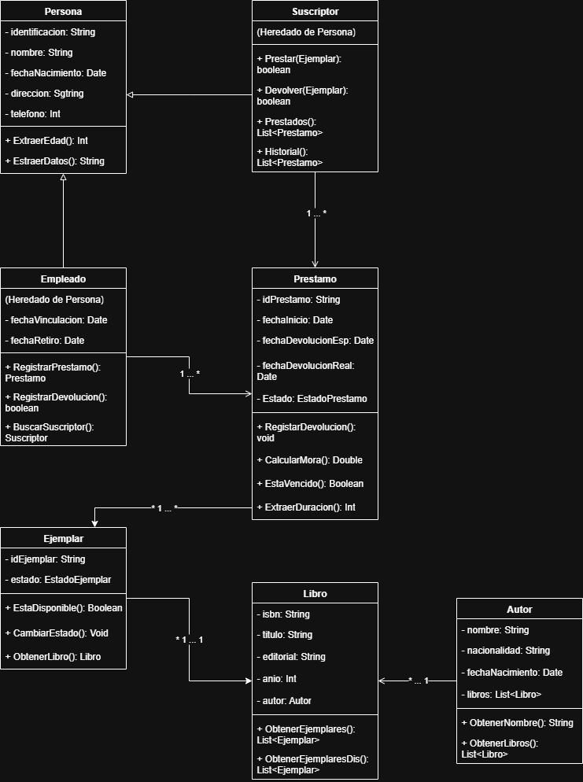

# 📚 Diagrama de Clases — Sistema de Préstamo de Biblioteca

Diagrama de clases UML que modela el proceso de préstamo de una biblioteca, incluyendo herencia, asociaciones y métodos. Elaborado con draw.io como ejercicio académico de modelado orientado a objetos.

---

## 🖼️ Diagrama

👉 **[Ver diagrama en Google Drive](https://drive.google.com/file/d/1zzEdpT6sHL2phkzIyOA7GSeTZqyQL_KY/view?usp=sharing)**



> *Si la imagen no carga, usa el enlace de arriba para visualizarlo.*

---

## 🗂️ Estructura

```
📦 biblioteca-diagrama-clases
 ┣ 📄 diagrama_clases.drawio   # Archivo editable (draw.io)
 ┣ 📄 diagrama_clases.png      # Imagen exportada del diagrama
 ┗ 📄 README.md
```

---

## 👨‍💻 Autor

Desarrollado como ejercicio académico de modelado orientado a objetos.
